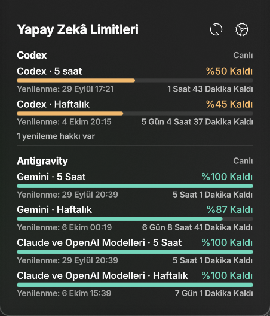
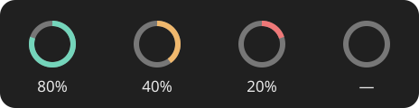
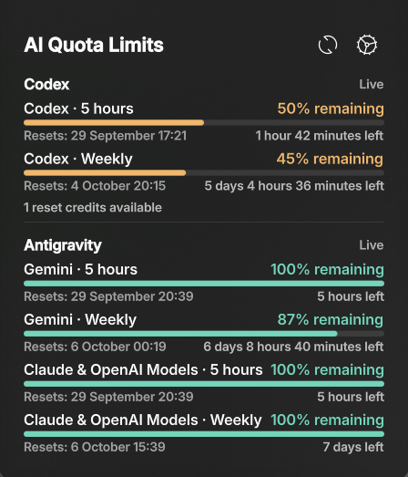

# Yapay Zekâ Limitleri · AI Quota Limits

## License

This project is licensed under the MIT License. See [LICENSE](LICENSE).

KDE Plasma 6 panelinde Codex, Claude Code ve Antigravity kullanım sınırlarını gösteren bir widget.

A KDE Plasma 6 widget for viewing Codex, Claude Code, and Antigravity usage limits in the panel.

[Türkçe](#turkce) · [English](#english)

<a id="turkce"></a>
## Türkçe

<p align="center"></p>

*Uygulamadan bir ekran görüntüsü. Gösterilen limitler ve yenilenme zamanları oturuma göre değişir.*

### Panel halkası

<p align="center"></p>

Halka, ayarlarda seçilen servisin ilk limit penceresinde **kalan kullanım oranını** gösterir. Yukarıdaki örnekler sırasıyla %80, %40, %20 ve veri yok durumudur. Varsayılan uyarı eşiği %30'dur:

| Renk | Varsayılan kalan kullanım | Anlamı |
| --- | --- | --- |
| Yeşil | %51–100 | Yeterli kullanım hakkı var. |
| Sarı | %31–50 | Kullanım hakkı azalıyor. |
| Kırmızı | %0–30 | Uyarı eşiğine ulaşıldı. |
| Gri | Veri yok | Seçilen servis için limit verisi alınamadı. |

Uyarı eşiğini ayarlardan değiştirebilirsiniz. Sarı aralık, seçilen eşikten sonraki 20 yüzde puanını kapsar; daha yüksek değerler yeşildir.

### Özellikler

- Panelde seçtiğiniz servisin kalan kullanımını renkli bir halka ile gösterir. Üzerine gelince kısa limit özeti açılır.
- Açılır pencerede servislerin 5 saatlik ve haftalık pencerelerini, kalan yüzdelerini, yenilenme tarih ve saatini ve kalan süreyi gösterir. Antigravity'de “Claude ve OpenAI Modelleri” için ayrı limit pencereleri gösterilir. Mevcutsa Codex yenileme hakları da görünür.
- Codex, Claude ve Antigravity servislerini ayrı ayrı gösterip gizleyebilirsiniz. Verisi olmayan servisleri gizleme seçeneği vardır.
- **Görünüm → Dil** ayarından Türkçe ve İngilizce arasında geçiş yapabilirsiniz. İlk kurulum dili Türkçedir.
- Yenileme aralığını, uyarı eşiğini ve panel halkasında izlenecek servisi ayarlayabilirsiniz. Uzun liste, görünür kaydırma çubuğu olmadan kaydırılabilir.

### Gereksinimler ve kurulum

KDE Plasma **6**, Python **3** ve `kpackagetool6` gerekir. İzlemek istediğiniz servislerin CLI uygulamalarını ayrıca kurup kendi hesaplarınızla oturum açmalısınız.

Depo kökünde:

```sh
kpackagetool6 -t Plasma/Applet -i .
```

Daha önce kurulu bir sürümü güncellemek için:

```sh
kpackagetool6 -t Plasma/Applet -u .
```

Ardından panelde **Araç Takımı Ekle → Yapay Zekâ Limitleri** yoluyla widget'ı ekleyin. Widget kimliği `org.stark.quota-panel`'dir.

### Servisleri bağlama

| Servis | Bağlantı |
| --- | --- |
| **Codex** | Codex CLI ile oturum açın. Widget, yerel CLI'nin `app-server` limit yanıtını okur. Gerekirse widget ayarlarındaki **Codex girişini aç** düğmesini kullanın. |
| **Claude Code** | Widget ayarlarında **Claude bağlantısını kur** düğmesine basın. Claude Code oturumunda ilk API yanıtından sonra durum satırı kullanım verisini yerel önbelleğe aktarır. Widget'ın Yenile düğmesi bu oturumdan bağımsız yeni kota isteği göndermez. |
| **Antigravity CLI** | CLI ile oturum açın. Widget, CLI'nın salt okunur `/usage` komutunu en fazla dakikada bir çalıştırır; aradaki yenilemeler önbelleği kullanır. Eski CLI sürümleri için **Antigravity CLI bağlantısını kur** düğmesiyle durum satırı aktarımını kullanabilirsiniz. Alternatif olarak kota verisi üreten bir JSON dosyası seçebilirsiniz; özel dosya seçildiğinde güncelleme o dosyayı üreten entegrasyona bağlıdır. |

Dil ve görünüm seçenekleri **Görünüm → Dil** sayfasından; bağlantı durumu ise **Bağlantılar** sayfasından yönetilir. Bir serviste veri görünmüyorsa önce bağlantı durumunu denetleyin, ardından widget'ın yenile düğmesini kullanın.

### Gizlilik

Kota bilgisi bu bilgisayardaki oturumlardan okunur. Widget hesap anahtarlarını Git deposuna kopyalamaz. Claude verisi `~/.cache/quota-panel/`, Antigravity verisi varsayılan olarak `~/.config/quota-panel/` altında yerel dosyalarda tutulur. Bu dosyaları ve kişisel ayarları depoya eklemeyin; `.gitignore` yaygın gizli ve üretilmiş dosyaları dışlar.

<a id="english"></a>
## English

<p align="center"></p>

*English visual translation of the widget. Select English in settings; quota values and reset times vary by session.*

### Panel ring

<p align="center"></p>

The ring shows the **remaining quota** in the first limit window of the service selected in settings. The examples above show 80%, 40%, 20%, and unavailable data. The default warning threshold is 30%:

| Color | Default remaining quota | Meaning |
| --- | --- | --- |
| Green | 51–100% | Plenty of quota remains. |
| Yellow | 31–50% | Quota is getting low. |
| Red | 0–30% | The warning threshold has been reached. |
| Gray | No data | No quota data is available for the selected service. |

You can change the warning threshold in settings. Yellow covers the next 20 percentage points above that threshold; higher values are green.

### Features

- A colored ring in the panel shows the remaining quota for the selected service. Hovering over it opens a compact summary.
- The popup shows five-hour and weekly windows, remaining percentages, reset date and time, and time until reset. Antigravity's Claude and OpenAI model quotas have their own clearly named windows. Codex reset credits appear when available.
- Show or hide Codex, Claude, and Antigravity independently. You can also hide services without data.
- Select Turkish or English from **Appearance → Language** in the settings. Turkish is the default.
- Configure the refresh interval, warning threshold, and service represented by the panel ring. Long lists remain scrollable without a visible scrollbar.

### Requirements and installation

You need KDE Plasma **6**, Python **3**, and `kpackagetool6`. Install and sign in to the CLI applications for the services you want to monitor.

From the repository root:

```sh
kpackagetool6 -t Plasma/Applet -i .
```

To update an existing installation:

```sh
kpackagetool6 -t Plasma/Applet -u .
```

Then add **AI Quota Limits** from the panel's **Add Widgets** menu. The widget ID is `org.stark.quota-panel`.

### Connecting services

| Service | Setup |
| --- | --- |
| **Codex** | Sign in with the Codex CLI. The widget reads rate limits from the local CLI's `app-server`. Its settings page can open the Codex login flow. |
| **Claude Code** | Select **Set up Claude connection** in the widget's **Connections** settings. After the first API response in a Claude Code session, the status line sends usage data to a local cache. The widget's refresh button cannot request a new Claude quota independently of that session. |
| **Antigravity CLI** | Sign in to the CLI. The widget runs the CLI's read-only `/usage` command at most once per minute and uses the cache between refreshes. For older CLI versions, **Set up Antigravity CLI** enables status-line capture. You can also select a JSON quota file produced by another integration; refreshing a custom file depends on that integration. |

Choose the interface language and visible services in **Appearance**; use **Connections** to check provider status. If usage data is missing, check the connection there and refresh the widget.

### Privacy

Quota data is read from sessions on your computer. The widget does not copy account credentials into the Git repository. Claude data is cached under `~/.cache/quota-panel/`; Antigravity data defaults to `~/.config/quota-panel/`. Keep these files and personal settings out of the repository. The `.gitignore` excludes common secret and generated files.
